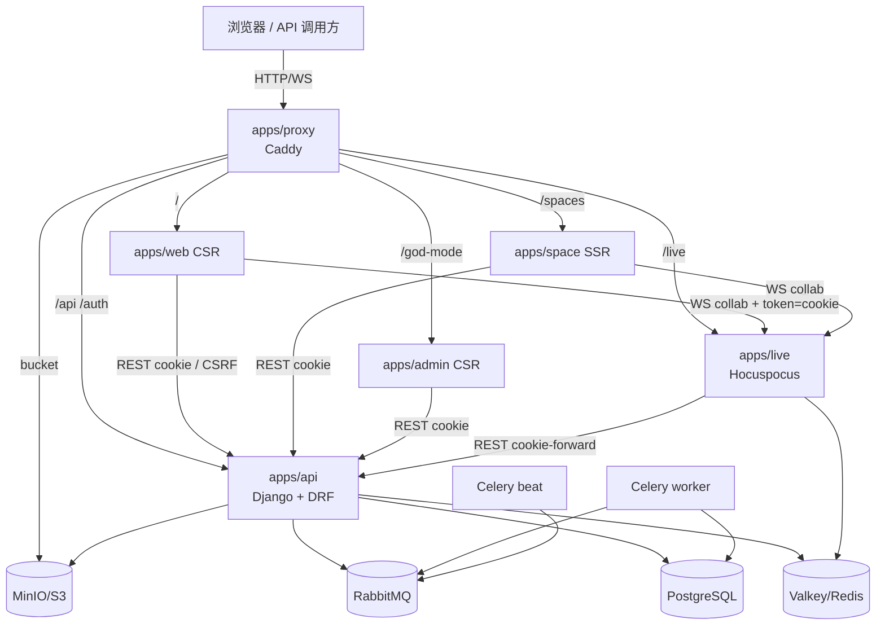
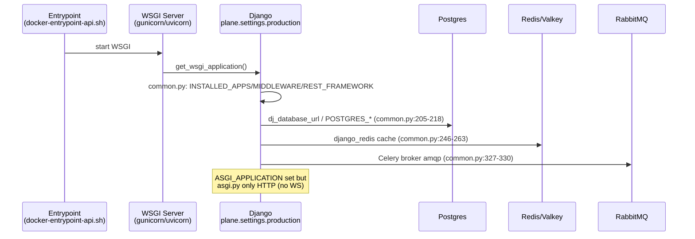
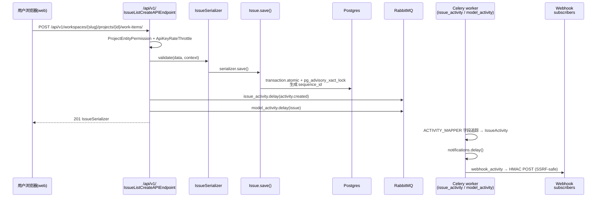

# SOURCE_ARCHITECTURE.md — Plane 源码架构（最重要文档）

## 分析快照

- 分支：`preview`；HEAD：`7cef741c2`；工作区：clean（仅新增 `./docs-analysis/`）；子模块：无。
- 分析范围：工作区实际源码静态只读分析；未运行构建/测试。
- 未覆盖范围：私有 EE/Cloud 仓库；动态运行行为；自动生成产物。

## 证据分类

- **Evidence**：直接由源码/配置证明，附 `路径:行号`。
- **Inference**：由多处证据合理推导。
- **Unknown**：静态分析无法可靠确认。

## 核心结论

[Evidence] Plane 是一个**面向团队的开源项目管理（issue/cycle/module/page/analytics）系统**，采用前后端分离 + 独立实时协同服务的多进程架构。后端为 Django/DRF（双 REST 表面 `/api/` 与 `/api/v1/`），前端为 3 个 React Router 7 应用（web 主应用、space 客户门户、admin 实例管理），实时协同由独立 Node/Hocuspocus 服务承担，Caddy 做反向代理与路由分发。

[Evidence] 架构最显著的特征是**“双轨并存”**——几乎每个关键子系统都存在新旧两套并行实现：后端两套 API + 两套 base view + 两套 permission 包；前端两套服务基类 + 两套 UI 库 + 本地/共享 store；以及从 Next.js 迁移到 React Router 的残留兼容层。

---

## 1. 仓库总体结构

```
plane/                       # monorepo 根（pnpm + Turbo）
├── apps/
│   ├── web/                 # 主工作区应用（CSR SPA，:3000，/）
│   ├── admin/               # 实例管理 God mode（CSR SPA，:3000，/god-mode）
│   ├── space/               # 客户门户 Spaces（SSR，:3000，/spaces）
│   ├── api/                 # Django 后端（apps/api/plane/）
│   ├── live/                # 实时协同服务（Node/Hocuspocus，:3000，/live）
│   └── proxy/               # Caddy 反向代理（:80/:443）
├── packages/                # 15 个共享 TS 包
│   ├── ui/                  # 旧 UI 库（HeadlessUI/Blueprint，正被 propel 取代）
│   ├── propel/              # 新设计系统（Base UI + cva + recharts）
│   ├── editor/              # TipTap 富文本编辑器（core/ce/ee 三分）
│   ├── services/            # 共享 API 客户端（axios）
│   ├── shared-state/        # MobX（仅 rich/work-item filters 真实导出）
│   ├── hooks/ utils/ constants/ types/ i18n/
│   ├── logger/ decorators/  # 仅 apps/live 使用
│   ├── tailwind-config/     # 统一 design token（variables.css）
│   ├── typescript-config/ codemods/
├── deployments/             # aio / cli / kubernetes / swarm 部署
├── docker-compose*.yml      # 容器编排（prod / local / test）
├── .github/workflows/       # 9 个 CI workflow
├── package.json pnpm-workspace.yaml turbo.json  # monorepo 配置
└── setup.sh                 # 开发引导（生成 .env / SECRET_KEY）
```

[Evidence] 跟踪文件 5250 个；`apps/` 3442、`packages/` 1736。`pnpm-workspace.yaml:1-6` 声明 `apps/*` 与 `packages/*` 为 workspace，但显式排除 `apps/api`（Python）与 `apps/proxy`（Caddy）。

## 2. 应用清单与职责

| 应用 | 技术栈 | 职责 | 运行方式 | Evidence |
| -- | -- | -- | -- | -- |
| `apps/web` | RR7 CSR + MobX + SWR | 用户主工作区（work items/cycles/modules/views/pages/analytics） | nginx SPA `:3000` `/` | `apps/web/react-router.config.ts:6`、`Dockerfile.web` |
| `apps/space` | RR7 SSR + MobX | 已发布项目的公开看板（"Spaces"） | `react-router-serve` `:3000` `/spaces` | `apps/space/react-router.config.ts:11`、`Dockerfile.space` |
| `apps/admin` | RR7 CSR + MobX + SWR | 实例管理 God mode（用户/工作区/邮件/OAuth/AI 配置） | nginx SPA `:3000` `/god-mode` | `apps/admin/react-router.config.ts:13`、`Dockerfile.admin` |
| `apps/api` | Django 4.2 + DRF + Celery | REST API、鉴权、业务逻辑、后台任务 | gunicorn/uvicorn WSGI `:8000` | `plane/wsgi.py:18`、`Dockerfile.api` |
| `apps/live` | Node + Express + Hocuspocus | 富文本/页面实时协同、PDF 导出 | `node dist/start.mjs` `:3000` `/live` | `apps/live/src/start.ts:13-24` |
| `apps/proxy` | Caddy 2.11 | 反向代理、TLS、路由分发、静态资源 | caddy `:80/:443` | `apps/proxy/Caddyfile.ce` |

## 3. 后端 Django 包结构（`apps/api/plane/`）

| 子包 | 职责 | Evidence |
| -- | -- | -- |
| `plane/app/` | **旧 `/api/` 表面**：ViewSets/Serializers/Permissions/urls（19 路由组） | `plane/app/urls/__init__.py:26-47` |
| `plane/api/` | **新 `/api/v1/` 表面**：APIView 风格端点（12 路由组，含 lite 端点） | `plane/api/urls/__init__.py:18-31` |
| `plane/db/` | 模型（~30 文件）、mixin、122 migrations、management | `plane/db/models/`、`plane/db/mixins.py` |
| `plane/authentication/` | 鉴权：adapter、provider（credentials/oauth）、session、views | `plane/authentication/adapter/base.py:35` |
| `plane/license/` | 实例/许可/加密配置、遥测、管理命令 | `plane/license/models/instance.py` |
| `plane/space/` | 公开看板 API（`/api/public/`） | `plane/space/urls/__init__.py` |
| `plane/bgtasks/` | ~34 个 Celery 任务模块 | `plane/bgtasks/*.py` |
| `plane/middleware/` | session、请求日志、请求体大小限制、读副本路由 | `plane/middleware/logger.py` |
| `plane/utils/` | 工具、SSRF 安全客户端、权限（与 app/permissions 重复）、读副本 router | `plane/utils/permissions/`、`plane/utils/core/dbrouters.py` |
| `plane/settings/` | common/production/local/test/redis/storage/openapi | `plane/settings/common.py` |
| `plane/web/` | 根路由 catch-all（SPA 兜底） | `plane/web/urls.py` |
| `plane/analytics/` | **stub**（仅 `apps.py`） | `plane/analytics/apps.py` |

## 4. 分层方式与模块依赖方向

[Evidence] **后端无显式 service/repository 层**。业务逻辑分散在：视图（View/ViewSet）→ 序列化器（Serializer.create/update，含 M2M 副作用）→ 模型 `save()` 重写（如 `Issue.save()` 用 Postgres advisory lock 生成 sequence_id）。数据访问直接使用 Django ORM。



> 图中每个节点均为已验证组件（见上表 Evidence）。`apps/live` 与 DB **无直连**，所有持久化经 Plane REST API（cookie 转发）。`apps/api` 不主动推送实时事件，仅将 origin 写入 Redis 供 live 读取。

### 前端包依赖方向（无环）

[Inference] 跨包依赖为干净 DAG，无循环：`types ← constants ← utils ← {propel, ui, editor, services, shared-state}`；`propel ← ui ← editor`；`hooks ← {propel, ui, editor}`；独立叶：`tailwind-config / typescript-config / decorators / logger`；`apps/live → {decorators, editor, logger, types, utils}`。

## 5. 应用入口与启动流程

### 5.1 后端启动（`apps/api`）

[Inference] 容器入口 `bin/docker-entrypoint-api.sh` → 运行 WSGI server（gunicorn/uvicorn）加载 `plane.wsgi.application`（`plane/wsgi.py:18`）。`DJANGO_SETTINGS_MODULE` 默认 `plane.settings.production`（`manage.py:10`、`celery.py:20`）。



[Evidence] `plane/asgi.py:18` 为 `ProtocolTypeRouter({"http": ...})`——`channels` 已 import 但**未注册任何 websocket consumer**，故实时能力完全外置到 `apps/live`。

### 5.2 实时服务启动（`apps/live`）

[Inference] `node dist/start.mjs` → `startServer()`（`apps/live/src/start.ts:13`）→ `new Server()` → `server.initialize()`（`redis → hocuspocus → routes`，`apps/live/src/server.ts:42-55`）→ `listen()`（`:95`）。注册 SIGTERM/SIGINT 优雅关闭（`start.ts:27-53`）。

### 5.3 前端启动

- web：`app/root.tsx`（RR7 root，`ThemeProvider` 5 主题）→ `app/provider.tsx` `AppProvider`（StoreProvider→AppProgressBar→TranslationProvider→Toast→StoreWrapper→InstanceWrapper→SWRConfig）。
- space：`app/providers.tsx` `AppProviders`（ThemeProvider→StoreProvider→AppProgressBar→TranslationProvider→ToastProvider→InstanceProvider）。
- admin：`providers/core.tsx` `CoreProviders`（ThemeProvider→AppProgressBar→ToastWithTheme→SWRConfig→StoreProvider→InstanceProvider→UserProvider）。

## 6. 配置系统

[Evidence] 后端：`plane/settings/common.py` 为基础，`production.py`/`local.py`/`test.py` 继承。大量行为由环境变量驱动（`DEBUG`、`DATABASE_URL`、`REDIS_URL`、`SECRET_KEY`、CORS、cookie、base URL、`ENABLE_*` 开关）。`InstanceConfiguration`（加密 key/value，`plane/license/models/instance.py`）存储运行时可改配置（SMTP、OAuth secret），经 `get_configuration_value()` 读取（`plane/license/utils/instance_value.py`）。

[Evidence] 前端：构建期注入 `VITE_*` 环境变量（`turbo.json:4-33` globalEnv），如 `VITE_API_BASE_URL`、`VITE_*_BASE_PATH`、`VITE_SENTRY_DSN` 等。

## 7. 错误模型 / 日志系统

- 后端异常处理：自定义 DRF handler `plane/authentication/adapter/exception.py:17`（`NotAuthenticated→401`、`Throttled→429`）；各 base view 的 `dispatch/handle_exception` 把 `IntegrityError/ValidationError/ObjectDoesNotExist/KeyError` 转为 400/404/500（`plane/api/views/base.py:64-113`）。**异常细节对客户端隐藏**，仅记日志。
- 日志：`RequestLoggerMiddleware`（耗时/状态，`plane/middleware/logger.py:26`）、`APITokenLogMiddleware`（持久化 `/api/v1/` 请求响应到 `APIActivityLog`，敏感头脱敏、API key 仅存 HMAC，`logger.py:80,117-146`）；Celery JSON 日志（`plane/celery.py:99-112`）。
- 前端：`@plane/logger`（winston，仅 `apps/live`）+ Sentry（可选）。

## 8. 安全边界

- 鉴权：Session（前端，`BaseSessionAuthentication` **关闭 CSRF** `plane/authentication/session.py:10-11`）+ API Key（`X-API-Key`，仅 v1，`plane/api/middleware/api_authentication.py:17`）。
- 授权：双层——permission class `has_permission` + 视图 queryset 过滤（按 `workspace__slug`/`project_id`）。`ROLE`：ADMIN=20/MEMBER=15/GUEST=5（`plane/app/permissions/base.py`）。
- SSRF 防护集中 `plane/utils/url_security.py`（`pinned_fetch`/`pinned_fetch_following_redirects`）：webhook 投递与 OAuth 头像下载均经 IP pinning + 重定向重校验 + allowlist（`common.py:56-91`）。
- Webhook：HMAC-SHA256 签名，失败重试 5 次（退避 600s），耗尽后自动停用并通知（`plane/bgtasks/webhook_task.py:242-365`）。
- 其他：`SECRET_KEY` 不安全值自检（`common.py:37-48`）；bot 账号禁止交互登录（`adapter/base.py:339`）；API key 日志仅存 HMAC。

## 9. 进程 / 线程 / 异步任务模型

[Evidence] 进程拓扑（`docker-compose.yml`）：`api`（Django WSGI）、`worker`（Celery worker）、`beat-worker`（Celery beat + DatabaseScheduler）、`migrator`（一次性 migrate）、`live`（Node 单进程，无 cluster，水平扩展靠 Redis pub/sub）、`web/space/admin`、`proxy`。Celery beat 静态调度 ~13 个周期任务（`plane/celery.py:44-95`）。

[Inference] 异步任务全部经 RabbitMQ → Celery；信号几乎不用（仅 `plane/db/models/user.py:298` 一个 `post_save`），改用显式 `task.delay()` 调用，便于追踪与测试。

## 10. 平台抽象 / 扩展机制

- CE/EE 扩展缝（详见 `扩展机制.md`）：前端 `extendedRoutes` 空数组（`apps/web/app/routes/extended.tsx`）、`Base*Store` 命名、`@plane/editor` 的 `ce/`+`ee/`（`ee/` 仅 `export * from "src/ce/..."`，`packages/editor/src/ee/extensions/index.ts`）。
- 后端：`plane/app/views` 大型聚合 `__init__.py`，按域分子包。

## 11. 数据依赖 / 控制流（关键调用链）



> 序列中每步对应真实符号（`plane/api/views/issue.py:449`、`plane/db/models/issue.py:180-214` advisory lock、`plane/bgtasks/issue_activities_task.py:1503`、`plane/bgtasks/webhook_task.py:393-465`）。

## 12. 生成代码 / vendored source

- 自动生成：React Router `typegen`、i18n `TTranslationKeys`、（可选）drf-spectacular OpenAPI、Celery beat DB schedule。
- vendored 静态数据：`packages/utils/src/tlds.ts`。

## 13. 技术债务 / 架构风险 / 文档与源码冲突

详见下节“架构边界审计”与各专题文档。核心债务：双 API 表面、重复 permission 包、前端服务层未完成迁移、UI 库迁移半途、Next.js 残留、无 CI 测试执行。

---

## 架构边界审计

| 维度 | 发现 | 证据 | 影响 |
| -- | -- | -- | -- |
| **重复实现（后端双 API）** | `/api/`（ViewSets）与 `/api/v1/`（APIViews）暴露同一批资源（issue/cycle/module/project/member…），auth/permission/base class/response shape 各异 | `plane/urls.py:17-24`、`plane/api/views/base.py:49` vs `plane/app/views/base.py:48` | 双倍维护；行为漂移；安全修复需两处落地 |
| **重复实现（permission 包）** | `plane/app/permissions/project.py` 与 `plane/utils/permissions/project.py` **byte-identical**（各 146 行） | `diff` 无差异 | 只改一处即回归（近期 scoping commits 正落在此区） |
| **重复实现（issue 三命名）** | `/api/v1/` 下 `old_url_patterns`(issues/) + `new_url_patterns`(work-items/) 指向同一视图 | `plane/api/urls/work_item.py:24-156` | URL 表面膨胀 |
| **重复实现（前端服务层）** | web 本地 46 个 service 类 vs `@plane/services`（space/admin 用）；共享基类**无 401 拦截器** | `apps/web/core/services/api.service.ts:11` vs `packages/services/src/api.service.ts:14` | 迁移半途；行为不一致 |
| **重复实现（UI 库）** | `@plane/ui`（旧）与 `@plane/propel`（新）并存，ui 反向依赖 propel，重复 Button/Tooltip/Icon | `packages/ui/package.json:37` | 双套组件、双 displayName |
| **跨层调用 / 职责重叠** | 业务逻辑散落 view+serializer+model.save（无 service 层）；序列号生成在 model；M2M 副作用在 serializer | `plane/db/models/issue.py:180`、`plane/app/serializers/issue.py:199` | 逻辑分散，难测试、难复用 |
| **全局状态** | 后端 `crum.get_current_user()`（`CurrentRequestUserMiddleware`）隐式注入 created_by；读副本经 `asgiref.local` request scope | `plane/db/models/base.py:23-44`、`plane/utils/core/request_scope.py` | 隐式依赖，测试需设上下文 |
| **名义能力（dormant）** | `channels`（无 WS consumer）、`plane/analytics`（stub）、GitHub/Slack 集成模型（CE 无消费视图/任务） | `plane/asgi.py:18`、`plane/analytics/apps.py`、`plane/db/models/integration/github.py` | 误导读者；占位代码 |
| **CSRF 关闭** | REST session 鉴权关闭 CSRF（依赖 SameSite + Secure cookie） | `plane/authentication/session.py:10-11` | 安全边界依赖 cookie 属性正确配置 |
| **隐式生命周期** | 软删除级联经 Celery 异步（`soft_delete_related_objects.delay`）最终一致 | `plane/db/mixins.py:72-82` | 删除后短时间内关联对象仍可见 |
| **未配置/无效配置** | `packages/tailwind-config/package.json:10` `main` 指向不存在的 `tailwind.config.js`；`packages/typescript-config/nextjs.json` 无消费者；`apps/web/app/layout.tsx` 死代码 | 上述路径 | 迁移残留，易误读 |
| **迁移残留** | 三前端应用 `compat/next/` 形状不一致；web `useRouter().push` 用 setTimeout + 强制尾斜杠 | `apps/*/app/compat/next/*` | 潜在导航 bug |

## 已确认事实

- 多进程架构：Caddy → {web(CSR), space(SSR), admin(CSR), api(Django WSGI), live(Node)}；api + worker + beat + migrator；PG/Valkey/RabbitMQ/MinIO。
- 后端双 REST 表面 + 重复 permission/base view；前端双服务层 + 双 UI 库 + 本地/共享 store。
- 实时协同完全外置到 apps/live，经 REST API 持久化，经 Redis 多实例同步。
- ASGI 仅 HTTP（channels 名义存在但未用）。

## 合理推断

- CE/EE 扩展缝（`extendedRoutes`/`Base*Store`/`ee/`）由私有 `plane-cloud`/`plane-ee` 仓库填充。
- `channels`、GitHub/Slack 集成模型为 EE 预留，CE dormant。

## Unknown 与待验证事项

- 私有 EE 仓库内容；api↔live 之间是否存在文档外的协议（仓库内未见 pub/sub 推送，仅 Redis origin 写入）；生产是否启用读副本/APM/OTLP。

## 批判性评估

- “双轨并存”是本仓库最大的架构健康度问题：几乎每个子系统都处在新旧迁移的中间态，带来显著的重复、漂移与“只修一处”的回归风险。这本身是可理解的演进代价，但应在架构文档中显式标注为“过渡态”而非稳定态。
- 后端缺少 service/repository 抽象，使业务规则难以单元测试、难以在双 API 间复用，是 PQL/外部集成分歧（v1 显式拒绝 `pql/filters`）等技术债的根因之一。

## 建设性改善建议

- [Recommendation] **后端双 API 收敛**：以 `/api/v1/` 为目标，逐步弃用 `/api/` ViewSets；统一 base view 与 permission 包（消除重复）。优先级：高；难度：高。
- [Recommendation] **引入薄 service 层**：将 issue/cycle/module 的业务规则从 view+serializer+model 抽出，便于双 API 共享与单测。优先级：中；难度：中。
- [Recommendation] **清理 dormant/名义代码**：移除或显式标注 `plane/analytics`、`channels` WS、GitHub/Slack 模型在 CE 的状态，避免误导。优先级：低；难度：低。
- [Recommendation] **完成前端两项迁移**：服务层（补 401 拦截器）、UI 库（弃 ui 用 propel）。优先级：中；难度：中。

## 主要证据索引

- `plane/urls.py:17-24`（6 URL 表面）、`plane/settings/common.py:97-392`
- `plane/celery.py:38-118`、`plane/asgi.py:18`、`plane/wsgi.py:18`
- `plane/app/urls/__init__.py:26-47`、`plane/api/urls/__init__.py:18-31`、`plane/api/urls/work_item.py:24-156`
- `plane/api/views/base.py:49-266`、`plane/app/views/base.py`、`plane/db/mixins.py:48-90`、`plane/db/models/base.py:17-47`
- `plane/authentication/adapter/base.py:35-408`、`plane/authentication/session.py:8-11`
- `plane/bgtasks/issue_activities_task.py:1503-1587`、`plane/bgtasks/webhook_task.py:242-465`
- `apps/live/src/start.ts:13-63`、`apps/live/src/server.ts:27-127`、`apps/live/src/hocuspocus.ts:45-51`
- `apps/web/react-router.config.ts:6`、`apps/web/app/provider.tsx:36`、`apps/web/core/store/root.store.ts:75`
- `docker-compose.yml:1-178`、`apps/proxy/Caddyfile.ce`
- `docs-analysis/evidence/backend-url-index.txt`（395 路由）
