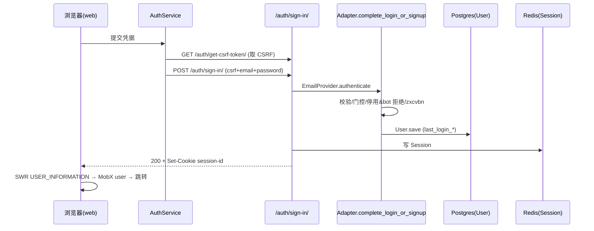
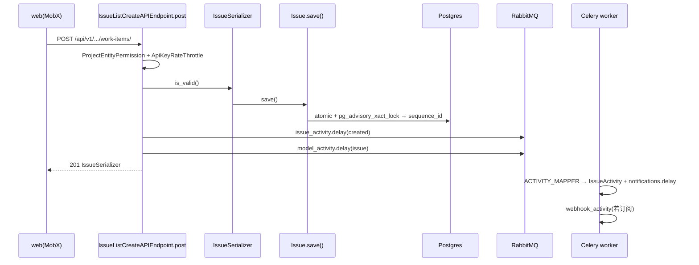
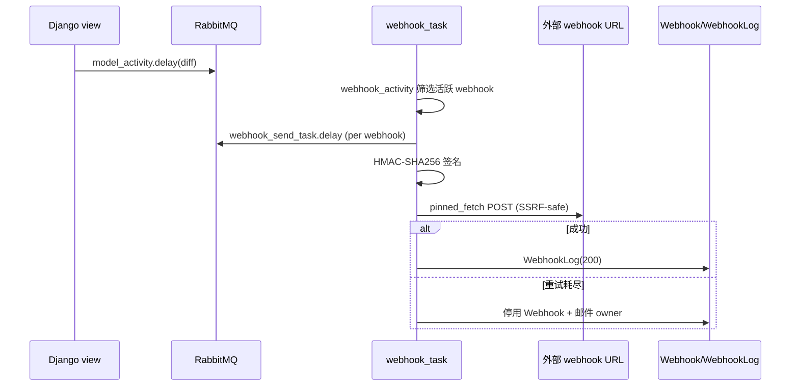
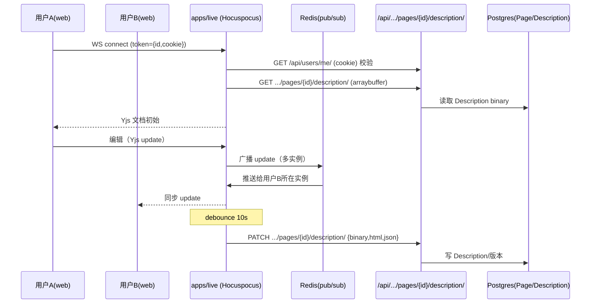

# 核心数据流.md — 关键业务数据流端到端追踪

## 分析快照

- 分支：`preview`；HEAD：`7cef741c2`；工作区：clean（仅新增 `./docs-analysis/`）；子模块：无。
- 分析范围：从源码追踪的关键写/读/协同流程；未运行动态验证。
- 未覆盖范围：私有 EE 流程；性能实测。

## 证据分类

- **Evidence**：`路径:行号` + 符号，每步对应真实文件/类型/函数。
- **Inference**：跨步骤推导。
- **Unknown**：静态无法确认的运行行为。

## 核心结论

[Evidence] 追踪了 6 条最关键数据流：① 用户鉴权（登录/注册/OAuth）；② Work Item（Issue）创建；③ Issue 更新与活动/通知；④ 出站 Webhook 投递；⑤ 页面（Page）实时协同编辑与持久化；⑥ 文件上传。共同特征：前端 MobX+SWR → REST（cookie/CSRF 或 API Key）→ Django 视图 → 序列化器/模型（Postgres）→ **fire-and-forget Celery 任务**做活动/通知/webhook；实时编辑走独立 live 服务经 REST API 持久化。

---

## 数据流 1：用户登录（Session 建立）

- 触发：浏览器提交登录表单。
- 前端：`apps/web` 登录页 `(home)` → `AuthBase` → `apps/web/core/services/auth.service.ts`（先 `requestCSRFToken()` GET `/auth/get-csrf-token/`）。
- 通信：POST `/auth/sign-in/`（带 CSRF cookie + `csrfmiddlewaretoken`）。
- 后端入口：`SignInAuthEndpoint`（`plane/authentication/views/app/email.py`）→ `EmailProvider`/`CredentialAdapter`。
- 业务：`Adapter.complete_login_or_signup()`（`plane/authentication/adapter/base.py:309-408`）——邮箱校验、signup 门控（`ENABLE_SIGNUP`）、停用账号/bot 拒绝、密码 `zxcvbn`、`save_user_data()`、（OAuth）SSRF 安全头像下载。
- 持久化：`User` 更新 `last_login_*`；Session 写入（`SESSION_ENGINE=plane.db.models.session`，Redis）。
- 返回：Set-Cookie `session-id`（HttpOnly；Secure 仅当全 HTTPS）。
- 前端更新：`authentication-wrapper.tsx:45` SWR `USER_INFORMATION` → MobX user store → 重定向到工作区。

- 错误路径：`AuthenticationException` → `auth_exception_handler`（`plane/authentication/adapter/exception.py:17`）→ 结构化错误码（前端 `EAuthenticationErrorCodes` 映射）。
- [Evidence] OAuth（Google/GitHub/GitLab/Gitea）走 initiate→callback 两步；magic code 走 generate→sign-in/sign-up。

## 数据流 2：Work Item（Issue）创建

- 触发：用户在项目内新建 issue。
- 前端：web issue store action → `IssueService`（本地 `apps/web/core/services/`）→ POST `/api/v1/workspaces/{slug}/projects/{id}/work-items/`（或旧 `/api/.../issues/`）。
- 后端入口：`IssueListCreateAPIEndpoint.post`（`plane/api/views/issue.py:449`），`permission_classes=[ProjectEntityPermission]`，`use_read_replica=True`。
- 校验：`IssueSerializer.is_valid()`；external_id/source 去重（409）。
- 持久化：`serializer.save()` → `Issue.save()`（`plane/db/models/issue.py:180-214`）`transaction.atomic()` + `pg_advisory_xact_lock(project_id)` 生成 `sequence_id`/`sort_order`。
- 异步副作用：`issue_activity.delay("issue.activity.created")`（`plane/api/views/issue.py:499`）+ `model_activity.delay()`（`:512`）。
- 返回：201 `IssueSerializer.data`。
- 前端更新：MobX issue store 插入；SWR 失效相关列表。

- 事务边界：sequence_id 在事务+advisory lock 内；活动/通知/webhook 异步，无跨 DB+MQ 事务。
- [Evidence] list 端点拒绝 `pql`/`filters` 参数（`plane/api/views/issue.py:317-329`）。
- [Inference] 双 API 表面（`/api/` IssueViewSet vs `/api/v1/` APIEndpoint）创建路径略有差异但共享模型与活动任务。

## 数据流 3：Issue 更新 → 活动/通知

- 触发：PATCH issue 字段（state/assignee/label…）。
- 后端：`IssueDetailAPIEndpoint.patch`（`plane/api/views/issue.py:525`）或旧 `IssueViewSet`；`ChangeTrackerMixin` 捕获 `_changes_on_save`。
- 异步：`issue_activity.delay(current_instance, requested_data, …)` → `plane/bgtasks/issue_activities_task.py:1503` → `ACTIVITY_MAPPER`（`:1540-1568`）分派到 ~30 字段追踪器 → 批量建 `IssueActivity` → `notifications.delay()`（`:1587`）；并写 Redis origin（`issue_id→origin, ex=600`，`:1529-1531`）供 live 读取。
- 持久化：`Issue` 更新 + `IssueActivity` 批量插入。
- 前端：列表/详情经 SWR 刷新；实时（若打开页面）经 live 广播。

## 数据流 4：出站 Webhook 投递

- 触发：issue/project 等创建/更新 → `model_activity.delay()`（`plane/bgtasks/webhook_task.py:478`）diff 旧/新 JSON → `webhook_activity`（`:393`）按事件类型筛选活跃 webhook → 每 webhook 一个 `webhook_send_task.delay()`（`:450`）。
- 投递：HMAC-SHA256 签名（`:297-304`）→ `pinned_fetch`（SSRF 安全，IP pinning + 重定向重校验 + allowlist，`:317-325`）→ POST → 写 `WebhookLog`。
- 重试/熔断：`RequestException` 自动重试 5 次（退避 600s）；耗尽后**自动停用 webhook + 邮件通知 owner**（`:355-365`）。
- 事务边界：投递与主请求完全异步解耦。

## 数据流 5：页面（Page）实时协同编辑与持久化

- 触发：用户打开 Page（`CollaborativeDocumentEditorWithRef`）。
- 前端：`apps/web/core/components/pages/editor/editor-body.tsx:190-214` 构造 WS URL（`LIVE_BASE_URL→wss`+`/collaboration`）；`packages/editor/src/core/hooks/use-yjs-setup.ts:62` 建 `HocuspocusProvider`（token=`JSON.stringify({id,cookie})`，y-indexeddb 本地持久化）。
- live 鉴权：`onAuthenticate`（`apps/live/src/lib/auth.ts:24-97`）解析 token → `UserService.currentUser(cookie)` GET `/api/users/me/` 校验 → 断言 `user.id===userId`。
- 加载文档：`Database.fetchDocument`（`apps/live/src/extensions/database.ts:26-70`）GET `.../pages/{id}/description/`（arraybuffer）；空则从 `description_html` 转 Yjs binary 回填。
- 协同：Yjs 文档经 Redis（`@hocuspocus/extension-redis`）跨实例同步；10s debounce 触发 `storeDocument`。
- 持久化：`storeDocument`（`database.ts:72-134`）转 `{binary,html,json}` → PATCH `.../pages/{id}/description/`（cookie 转发，经 Plane REST API，**不直连 DB**）；413 时跨服务 force-close。
- 副标题同步：`title-sync.ts` 监听 Yjs `title` fragment，debounce 5s 保存并向父页面广播 `property_updated`。

- 错误/重试：连接码 4000-4003 force-close 检测，最多 3 次重连（`use-yjs-setup.ts:18-22`）。
- [Inference] 10s debounce 内崩溃可能丢失最长 ~10s 编辑。

## 数据流 6：文件上传

- 前端：`generateFileUploadPayload`/`getFileMetaDataForUpload`（`packages/services/src/file/helper.ts`）→ 上传至后端 asset 端点。
- 后端：`/api/v1/.../assets/`（`plane/api/views/asset.py`）或 `/api/.../assets/`；经 `S3Storage`（boto3）写 MinIO/S3；建 `FileAsset`（MIME 白名单 `common.py:457-545`，脚本类 MIME 强制附件下载）。
- 异步：`storage_metadata_task`/`file_asset_task`（清理未完成上传，每日 beat）。

---

## 跨流程风险检查

| 风险 | 证据 | 说明 |
| -- | -- | -- |
| **DB 与副作用无分布式事务** | `plane/api/views/issue.py:491-520` | 主写成功但活动/通知/webhook 异步失败可能丢失（靠重试） |
| **状态多真相源** | MobX（本地）+ SWR（缓存）+ 后端（权威） | 需靠 SWR revalidate 与 store action 显式失效对齐 |
| **非幂等/竞态** | sequence_id 用 advisory lock 规避；external_id 去重靠查询（`issue.py:467-489`，查询与 save 非原子，理论存在并发 409 漏判，但 DB 唯一约束兜底） | 多数写靠 DB 约束保证 |
| **错误是否丢失** | `handle_exception` 把异常转 generic 消息（`plane/api/views/base.py:64-113`）；`BaseAPIView` 对部分异常未记日志 | 客户端拿不到细节，部分异常静默 |
| **越层访问** | 业务逻辑散落 view/serializer/model.save（无 service 层） | 双 API 各自实现，易漂移 |
| **数据重复转换** | 编辑器 binary↔html↔json 多次转换（`apps/live/src/extensions/database.ts`） | 转换失败（413）触发 force-close |
| **事务边界不明确** | 软删除级联异步（`plane/db/mixins.py:72-82`） | 删除后短时关联仍可见 |

---

## 已确认事实

- 6 条数据流均能从前端入口追踪到持久化/外部输出，证据完整。
- 写流程普遍“同步 DB 写 + 异步活动/通知/webhook”；实时编辑走 live 经 REST 持久化。
- advisory lock 保证 sequence_id 原子；webhook 有 HMAC + SSRF 防护 + 重试熔断。

## 合理推断

- 双 API 表面对同一资源创建/更新细节略有差异但共享模型与异步管线。
- 编辑器 10s debounce + 无 DB 直写兜底为潜在数据丢失点。

## Unknown 与待验证事项

- api↔live 是否有文档外的实时推送协议（仓库内未见，仅 Redis origin 写入）。
- external_id 去重在极高并发下是否完全依赖 DB 唯一约束（未逐字核对约束）。

## 批判性评估

- 写流程的“DB 成功即返回 + 副作用异步”模式吞吐好但一致性偏最终一致；对 webhook/通知的可靠性依赖 Celery 重试。
- `handle_exception` 部分异常未记日志，排障时信息不足。

## 建设性改善建议

- [Recommendation] 关键写流程（issue 创建/更新）引入 service 层统一编排 DB+活动任务，便于双 API 共享与单测。优先级：中；难度：中。
- [Recommendation] 统一 `handle_exception` 日志策略，确保所有异常落日志。优先级：中；难度：低。
- [Recommendation] 编辑器持久化增加崩溃 flush / 降低关键页面 debounce。优先级：低；难度：中。

## 主要证据索引

- 鉴权：`apps/web/core/services/auth.service.ts`、`plane/authentication/adapter/base.py:309-408`、`plane/authentication/adapter/exception.py:17`
- Issue 创建：`plane/api/views/issue.py:256-522`、`plane/db/models/issue.py:180-214`
- 活动/通知：`plane/bgtasks/issue_activities_task.py:1503-1587`、`plane/bgtasks/notification_task.py`
- Webhook：`plane/bgtasks/webhook_task.py:242-465`
- 实时编辑：`apps/web/core/components/pages/editor/editor-body.tsx:190-214`、`packages/editor/src/core/hooks/use-yjs-setup.ts:62-107`、`apps/live/src/lib/auth.ts:24-97`、`apps/live/src/extensions/database.ts:26-134`
- 文件上传：`packages/services/src/file/helper.ts`、`plane/api/views/asset.py`、`plane/settings/common.py:457-560`
