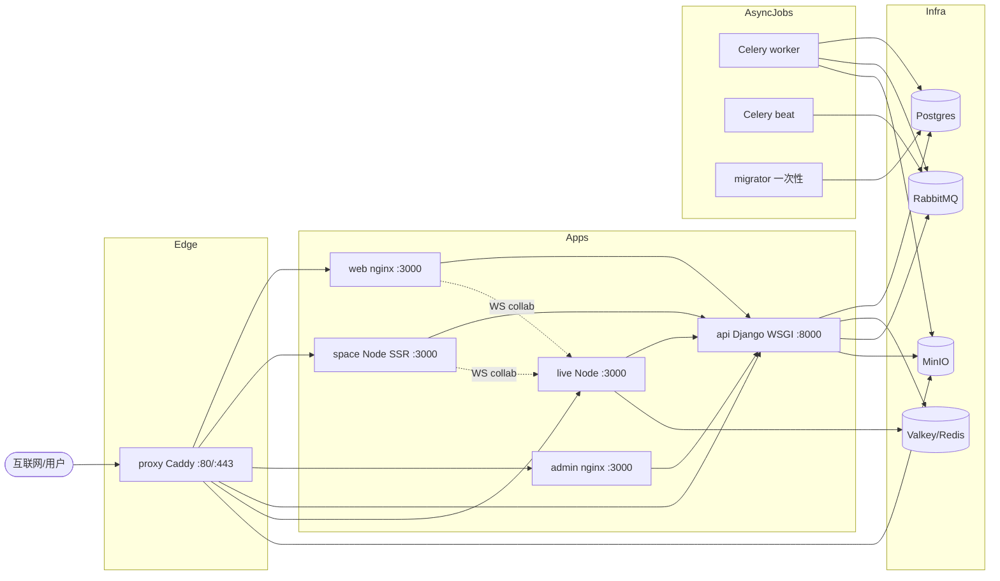
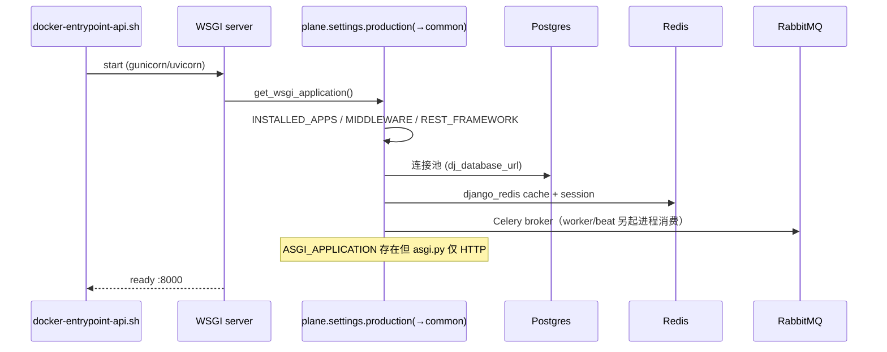

# 运行时架构.md — 运行期实际结构

## 分析快照

- 分支：`preview`；HEAD：`7cef741c2`；工作区：clean（仅新增 `./docs-analysis/`）；子模块：无。
- 分析范围：基于容器编排（`docker-compose*.yml`）、入口脚本、源码启动流程的**静态只读**分析；未实际启动进程。
- 未覆盖范围：实际运行时指标（连接池、并发量、内存）；动态故障恢复行为。

## 证据分类

- **Evidence**：`路径:行号` + 配置/符号。
- **Inference**：由入口与编排推导。
- **Unknown**：静态无法确认的运行行为。

## 核心结论

[Evidence] 运行时为**多进程、多服务**架构：Caddy 反向代理前置，分发到 5 个应用进程（web/space/admin/api/live）；后端 api 进程配合 Celery **worker** + **beat-worker** + 一次性 **migrator**；基础设施为 Postgres、Valkey（Redis 兼容）、RabbitMQ、MinIO。前端 web/admin 为浏览器侧 CSR，space 为 Node SSR，api 为 Django WSGI，live 为 Node 单进程协同服务。各进程经 Docker Compose 编排，依赖关系显式声明。

[Evidence] **编译期 vs 运行期差异显著**：编译产物（nginx 静态包、tsdown ESM、Django 包）≠ 运行期进程拓扑；`ASGI_APPLICATION` 在设置中存在但运行期 Django 不提供 WebSocket（实时由独立 live 进程承担）。

---

## 1. 进程组成

| 进程/容器 | 角色 | 语言/运行时 | 端口 | Evidence |
| -- | -- | -- | -- | -- |
| `proxy` | 反向代理/TLS/路由 | Caddy 2.11 | 80/443 | `docker-compose.yml:155-171`、`apps/proxy/Caddyfile.ce` |
| `web` | 主应用 CSR | nginx（静态 `build/client`） | 3000 | `docker-compose.yml:2-12`、`apps/web/Dockerfile.web` |
| `space` | 客户门户 SSR | Node `react-router-serve` | 3000 | `docker-compose.yml:25-36`、`apps/space/Dockerfile.space` |
| `admin` | 实例管理 CSR | nginx（静态 `build/client`） | 3000 | `docker-compose.yml:13-24`、`apps/admin/Dockerfile.admin` |
| `api` | 后端 REST | Django WSGI（gunicorn/uvicorn） | 8000 | `docker-compose.yml:37-51`、`apps/api/plane/wsgi.py:18` |
| `worker` | Celery worker | Python | — | `docker-compose.yml:52-67` |
| `beat-worker` | Celery beat 调度 | Python | — | `docker-compose.yml:68-83` |
| `migrator` | 一次性迁移 | Python | — | `docker-compose.yml:84-98`（`restart: no`） |
| `live` | 实时协同 | Node（tsdown ESM） | 3000 | `docker-compose.yml:99-106`、`apps/live/src/start.ts` |
| `plane-db` | 数据库 | Postgres 15.7 | 5432 | `docker-compose.yml:108-121` |
| `plane-redis` | 缓存/会话/pub-sub | Valkey 7.2.11（Redis 兼容） | 6379 | `docker-compose.yml:123-128` |
| `plane-mq` | Celery broker | RabbitMQ 3.13.6 | 5672/15672 | `docker-compose.yml:130-141` |
| `plane-minio` | 对象存储 | MinIO | 9000/9090 | `docker-compose.yml:143-152` |



> 各节点均为已验证容器（见上表）。`apps/live` 不直连 DB，经 REST API 持久化。

## 2. 主进程 / 渲染进程 / 子进程 / worker / 线程 / 异步任务

- **api**：WSGI 主进程（同步 worker，gunicorn/uvicorn 模型）；无 in-process 异步（channels 仅 HTTP）。
- **live**：**单 Node 进程，无 cluster**（`apps/live/src/start.ts`、`Dockerfile.live` `CMD ["node","apps/live"]`）；Express + `express-ws` 提供 WS；Hocuspocus 单例（`apps/live/src/hocuspocus.ts:38`）；多实例靠 Redis pub/sub 同步。Effect runtime 仅 PDF 导出使用。
- **worker / beat**：独立 Python 进程消费/调度 Celery 任务（`plane/celery.py:38`，app 名 `plane`）。
- **前端**：渲染发生在浏览器（web/admin）或 Node SSR（space），无 Electron/子进程。

## 3. 初始化顺序 / 依赖注入 / 生命周期

### 3.1 后端 api 启动时序



### 3.2 live 启动时序

```mermaid
sequenceDiagram
    participant N as node dist/start.mjs
    participant SRV as Server (apps/live/src/server.ts)
    participant R as RedisManager
    participant H as HocusPocusServerManager
    participant RT as Express routes
    N->>SRV: new Server(); initialize()
    SRV->>R: redisManager.initialize()
    SRV->>H: getInstance().initialize()
    H->>H: new Hocuspocus({onAuthenticate,onStateless,extensions,debounce:10000})
    SRV->>RT: setupRoutes(hocuspocusServer)
    SRV->>SRV: listen(:3000 or env.PORT)
    Note over N: 注册 SIGTERM/SIGINT/unhandledRejection/uncaughtException
```

> 证据：`apps/live/src/server.ts:42-55`（init 顺序）、`:95-104`（listen）、`apps/live/src/hocuspocus.ts:45-51`、`apps/live/src/start.ts:27-63`。

### 3.3 前端启动（web CSR）

`app/root.tsx` → `app/provider.tsx` `AppProvider` 链：StoreProvider→AppProgressBar→TranslationProvider→Toast→StoreWrapper（SWR 拉取 `USER_INFORMATION` → MobX action）→InstanceWrapper→SWRConfig。

## 4. 服务/状态/DB 连接生命周期

- DB 连接：Django 默认 `CONN_MAX_AGE`；Postgres `max_connections=1000`（`docker-compose.yml:112`）。读副本经 `ReadReplicaRoutingMiddleware` + `asgiref.local` request scope 路由（`plane/utils/core/dbrouters.py`）。
- Redis：django-redis 连接池（SSL 可选）；live 的 ioredis（重试策略，`apps/live/src/redis.ts`）。
- Session：cookie `session-id`（7 天，`common.py:377-380`）；admin `admin-session-id`（1 小时，`:383-384`）。

## 5. 后台任务 / 调度 / 事件系统 / 缓存 / 文件监听 / 插件加载

- 调度：Celery beat（`DatabaseScheduler` + 静态 `beat_schedule`，`plane/celery.py:44-118`）。
- 事件：**后端几乎不用 Django signal**（仅 `plane/db/models/user.py:298`），改显式 `task.delay()`。
- 实时事件：live 经 Redis `hocuspocus:admin` 频道广播跨实例（`apps/live/src/extensions/redis.ts`）；编辑器经 Hocuspocus stateless 消息（`apps/live/src/lib/stateless.ts`）。
- 缓存：django-redis（默认）+ 浏览器 SWR + y-indexeddb（编辑器本地）。
- 文件监听：开发期 vite/turbo `--watch`；运行期无 watcher。
- 插件加载：见 `扩展机制.md`（CE/EE 缝、TipTap 扩展、Hocuspocus 扩展、@plane/decorators 控制器）。

## 6. IPC / RPC / 网络通信

- 浏览器 ↔ api：REST/JSON（cookie + CSRF）。
- 浏览器 ↔ live：WebSocket（`/live/collaboration`，token=JSON `{id,cookie}`）。
- live ↔ api：axios REST（cookie 转发，`apps/live/src/services/page/core.service.ts`）。
- api ↔ worker/beat：经 RabbitMQ（Celery）。
- api ↔ live：无直接推送；api 仅写 Redis origin（`issue_activities_task.py:1529-1531`）供 live 读取。[Unknown] 是否存在文档外协议。

## 7. 资源清理 / 正常关闭 / 异常关闭 / 崩溃恢复

- **live 优雅关闭**：`start.ts:27-53` SIGTERM/SIGINT → `server.destroy()`（关 Hocuspocus 连接 + Redis + HTTP），`unhandledRejection`/`uncaughtException` 仅记录不退出。
- **api/worker/beat**：`restart: always`（`docker-compose.yml`），崩溃由 Docker 重启。
- **migrator**：`restart: no`，一次性。
- [Inference] 编辑器数据：Hocuspocus `debounce:10000`（10s 持久化）→ 崩溃可能丢失最长 ~10s 编辑（无 DB 直写兜底）。

## 8. 编译期 / 启动期 / 运行期 / 关闭期 区分

| 阶段 | 关键内容 |
| -- | -- |
| 编译期 | turbo build：vite（web/space/admin 静态包）、tsdown（live ESM、共享包）、react-router typegen、i18n 类型生成、（可选）drf-spectacular schema |
| 启动期 | 容器入口 → WSGI/Node/nginx 起服 → 连接 DB/Redis/MQ → live 注册扩展与路由 |
| 运行期 | 请求处理、WS 协同、Celery 消费、beat 调度、SWR/MobX 状态、软删除/清理周期任务 |
| 关闭期 | live 优雅 destroy；其余容器 Docker 重启策略 |

## 9. 平台差异 / 运行时故障模式

- SSR（space）与 CSR（web/admin）差异：space 在 Node 端渲染但多数数据仍客户端 MobX+SWR 拉取（SSR 收益有限，仅 OG metadata + 重定向）。
- 故障模式：MQ 宕机 → 异步任务（通知/webhook/活动）堆积但不阻塞主请求；Redis 宕机 → 缓存/会话失效 + live 多实例同步失效（单节点协同仍可用）；DB 宕机 → api 不可用。
- [Inference] `Caddyfile.ce:41` `trusted_proxies 0.0.0.0/0` → 信任任意来源的客户端 IP 头。

---

## 已确认事实

- 13 类容器/进程（含 4 类基础设施）；Caddy 边缘分发；api+worker+beat+migrator 同镜像不同入口。
- live 单 Node 进程 + Redis 多实例同步；WSGI 同步；ASGI 仅 HTTP。
- live 优雅关闭 + Docker `restart` 策略；编辑器 10s debounce 持久化。

## 合理推断

- 编辑器崩溃可能丢失最长 ~10s 编辑（基于 debounce + 无 DB 直写）。
- SSR space 的实际服务端数据预取很少（多为客户端）。

## Unknown 与待验证事项

- api↔live 是否存在文档外协议；生产连接池/并发上限实际值；崩溃恢复的实测 RTO。

## 批判性评估

- live 单进程无 cluster，水平扩展强依赖 Redis；Redis 可选（缺失则静默降级为单节点），运维需明确感知。
- 编辑器 10s debounce + 无 DB 兜底是数据丢失风险点（虽影响小）。
- `trusted_proxies 0.0.0.0/0` 默认值扩大了 IP 伪造面。

## 建设性改善建议

- [Recommendation] live 增加 cluster/进程管理或明确文档化“必须 ≥2 实例 + Redis 才有高可用协同”。优先级：中；难度：中。
- [Recommendation] 编辑器持久化降低 debounce 或增加崩溃 flush；关键页面可缩短 debounce。优先级：低；难度：中。
- [Recommendation] 收紧 `trusted_proxies` 默认，改为按部署环境显式配置。优先级：中；难度：低。
- [Recommendation] 对 MQ/Redis 不可用增加显式降级与告警（而非静默）。优先级：中；难度：中。

## 主要证据索引

- `docker-compose.yml:1-178`、`docker-compose-local.yml`、`docker-compose-test.yml`
- `apps/api/plane/wsgi.py:18`、`plane/asgi.py:18`、`plane/celery.py:38-118`
- `apps/live/src/start.ts:13-63`、`apps/live/src/server.ts:27-127`、`apps/live/src/hocuspocus.ts:45-51`、`apps/live/src/redis.ts:62-66`
- `apps/proxy/Caddyfile.ce:6-41`
- `plane/settings/common.py:205-238,377-384`、`plane/utils/core/dbrouters.py`
